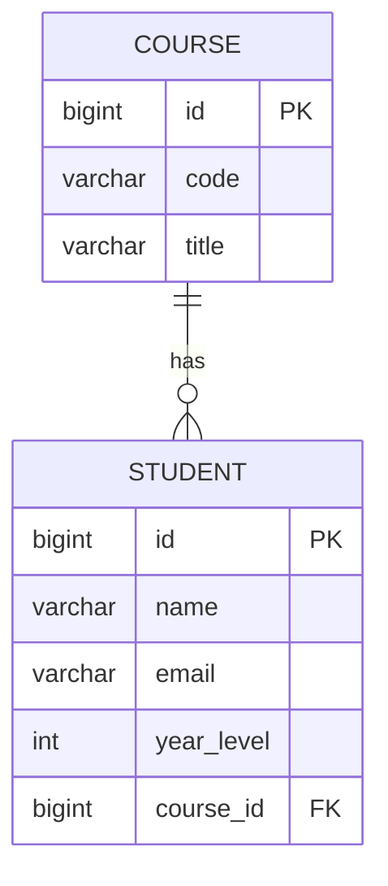

# Spring Boot CRUD Assignment Report

## Project Title
Student and Course Management System using Spring Boot, JPA, JSP, and H2

## 1) Entity Relationship Design

### Chosen Entities
- `Student`
- `Course`

### Relationship
- One `Course` has many `Student` records.
- Each `Student` belongs to one `Course`.
- Mapping used:
  - `Course` uses `@OneToMany(mappedBy = "course")`
  - `Student` uses `@ManyToOne` with `@JoinColumn(name = "course_id")`

### Mermaid ER Diagram


### Entity Snippet
```java
@OneToMany(mappedBy = "course", cascade = CascadeType.ALL)
private List<Student> students;

@ManyToOne(fetch = FetchType.LAZY)
@JoinColumn(name = "course_id", nullable = false)
private Course course;
```

### Screenshot Placeholder
`[Insert ER Diagram Screenshot Here]`

---

## 2) Populate Database

- Tables are generated by JPA with `spring.jpa.hibernate.ddl-auto=create-drop`.
- Sample data is inserted through `src/main/resources/data.sql`.
- Total inserted rows:
  - `courses`: 10
  - `students`: 10

```sql
INSERT INTO courses (id, code, title) VALUES (1, 'CSE101', 'Programming Fundamentals');
INSERT INTO students (id, name, email, year_level, course_id) VALUES (10, 'Sara Das', 'sara.das@bits.edu', 4, 10);
```

### Screenshot Placeholder
`[Insert H2 Console Screenshot with 10 Rows in Each Table]`

---

## 3) Create Operation

### Implementation
- Added JSP forms:
  - `course-form.jsp`
  - `student-form.jsp`
- Added controller POST methods to save new records through the service layer.
- Added validation and error handling for integrity issues.

### Controller Snippet
```java
@PostMapping
public String createStudent(@Valid @ModelAttribute("student") Student student,
                            BindingResult bindingResult, Model model) {
    if (bindingResult.hasErrors()) {
        model.addAttribute("courses", courseService.findAll());
        return "student-form";
    }
    studentService.save(student);
    return "redirect:/students";
}
```

### Exception Handling
- `@ControllerAdvice` handles:
  - `DataIntegrityViolationException`
  - `IllegalArgumentException`
- Failures are shown in `error.jsp`.

### Screenshot Placeholders
- `[Insert Add Student Form Screenshot]`
- `[Insert Add Course Form Screenshot]`
- `[Insert Integrity Violation Error Screenshot]`

---

## 4) Read Operation

### Implementation
- `student-list.jsp` shows all students.
- `course-list.jsp` shows all courses.
- Controller fetches data through service classes and binds to JSP using model attributes.

### Custom Inner Join Query
```java
@Query("""
       select new com.bits.springcrud.dto.StudentCourseView(
           s.id, s.name, s.email, s.yearLevel, c.code, c.title
       )
       from Student s
       inner join s.course c
       order by s.id
       """)
List<StudentCourseView> fetchStudentCourseDetails();
```

### Screenshot Placeholders
- `[Insert Student List Screenshot]`
- `[Insert Course List Screenshot]`
- `[Insert Inner Join Result Table Screenshot]`

---

## 5) Update Operation

### Implementation
- Added edit links in list pages.
- Forms open with existing values.
- Save endpoint updates when `id` is present and creates when `id` is null.

### Screenshot Placeholders
- `[Insert Edit Student Screenshot]`
- `[Insert Edit Course Screenshot]`
- `[Insert Updated Record Screenshot]`

---

## 6) Layered Architecture

### Repository Layer
- `StudentRepository extends JpaRepository<Student, Long>`
- `CourseRepository extends JpaRepository<Course, Long>`
- Includes custom inner join query.

### Service Layer
- `StudentService` and `CourseService`
- Implementations:
  - `StudentServiceImpl`
  - `CourseServiceImpl`

### Controller Layer
- `HomeController`
- `StudentController`
- `CourseController`
- `GlobalExceptionHandler`

### View Layer
- `student-list.jsp`
- `student-form.jsp`
- `course-list.jsp`
- `course-form.jsp`
- `error.jsp`

---

## 7) Testing

### Repository Test
- `StudentRepositoryTest` uses `@DataJpaTest`.
- Validates that inner join query returns expected rows.

### Service Test
- `StudentServiceTest` uses JUnit and Mockito.
- Verifies save delegation and join data delegation.

```java
@Test
void fetchJoinedStudentCourseData_shouldDelegateToRepository() {
    when(studentRepository.fetchStudentCourseDetails()).thenReturn(expected);
    List<StudentCourseView> actual = studentService.fetchJoinedStudentCourseData();
    assertEquals(1, actual.size());
}
```

### Screenshot Placeholder
`[Insert Test Execution Screenshot Here]`

---

## 8) Challenges and Solutions

1. JSP rendering setup in Spring Boot
- Challenge: JSP requires extra dependencies.
- Solution: Added `tomcat-embed-jasper` and JSTL dependencies in `pom.xml`.

2. Data integrity failures
- Challenge: Duplicate email and invalid foreign key can fail save.
- Solution: Added global exception handling with `@ControllerAdvice`.

3. Identity restart after seed data
- Challenge: Auto increment conflicts after fixed IDs in seed script.
- Solution: Added `ALTER TABLE ... RESTART WITH 11` in `data.sql`.

---

## 9) How to Run

```bash
mvn clean test
mvn spring-boot:run
```

Open in browser:
- `http://localhost:8080/students`
- `http://localhost:8080/courses`
- `http://localhost:8080/h2-console`

---

## 10) GitHub URL

`https://github.com/alienx5499/BITSSpringCRUDApp`

